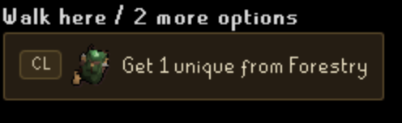

# Xtreme Tasker

Xtreme Tasker is a community game mode powered by a dedicated RuneLite plugin. It extends the official Tasker game mode by adding Combat Achievements, Collection Log goals, Achievement Diaries, and additional rules.

 Check out AmTrollin's **[Xtreme Tasker](https://www.youtube.com/playlist?list=PLyKVvPO_c8ffVO0H73Kxnnwz5J6DZir4H)** series to see the plugin in action. 
Starting your own Xtreme Tasker series? Let us know and we'll add it here!

 Join the XT community on [Discord](https://discord.gg/cPYdzpP8YU)

## Overview

* Roll randomized Combat Achievement, Collection Log, and Achievement Diary tasks
* Progress through Easy, Medium, Hard, Elite, and Master tiers
* Track your current task, elapsed time, completion date, requirements, and tier progress
* Search, filter, and sort the full task list
* Optional HUD overlay to keep your current task visible while playing
* Compact View for a smaller plugin panel

## Additional Documentation

* [Release Notes](docs/RELEASE_NOTES.md)
* [Rules](docs/RULES.md)

## Getting Started

Open the Xtreme Tasker overlay. If importing progress from an existing account, go to Help → Sync before rolling your first task to import completed Combat Achievements, Achievement Diaries, and known Collection Log task completions.

Collection Log item progress is refreshed automatically whenever you open your in-game Collection Log. This only updates the underlying Collection Log item data used by Xtreme Tasker. Press Help → Sync to find task completions from Combat Achievements, Achievement Diaries, and the latest Collection Log item data, then review and apply them manually.

Then, just head to Current tab to roll your first task! 

## Features

### Current Task

View requirements, open relevant wiki pages, track elapsed time, and roll your next task after completion.

#### Optional HUD Overlay

Keep your current task visible without leaving the game.

### Task List

Browse the full task list with search, filtering, sorting, and progress tracking. Open any task to view requirements, completion progress, detailed information, and relevant wiki links.

### Account Sync

Import completed Combat Achievements, Achievement Diaries, and Collection Log tasks into Xtreme Tasker, then review the proposed task completions before applying them. Account Sync also identifies tasks that no longer meet in-game requirements, helping keep your plugin progress accurate.

Collection Log progress is refreshed automatically whenever you open your in-game Collection Log. This updates only the underlying Collection Log item data used to evaluate task completion. Newly eligible Collection Log tasks are added to the Help → Sync review panel when you press Sync and must be manually marked complete.

When plugin adds new tasks, they'll appear in the Tasks tab with temporary indicators and a **Show New Tasks** filter.

## Rules

Xtreme Tasker follows the official Tasker ruleset with additional rules for the expanded task list. See the full [Xtreme Tasker Rules](docs/RULES.md).

Grandmaster Combat Achievements are included in the **Master** tier.

## Privacy

Xtreme Tasker stores progress locally in your RuneLite profile and mirrors it to RuneLite config for compatibility. No account progress or gameplay data is sent to external services.

Sync only reads data already available to RuneLite, such as Combat Achievements, Achievement Diaries, skill progress, and Collection Log entries that have been viewed in-game. Collection Log data is refreshed automatically when the Collection Log interface is opened. No tasks are automatically completed.

## Credits

Xtreme Tasker builds on the official Tasker game mode and was inspired by Tedious' Collection Log Master.

Thanks to everyone who has tested the plugin, reported bugs, and shared feedback.
