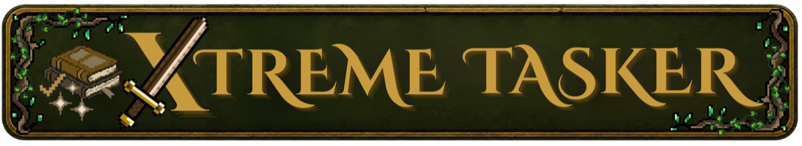

  

Xtreme Tasker is a new community game mode powered by a dedicated RuneLite plugin.

It extends the official Tasker game mode beyond Collection Log tasks by adding Combat Achievement and Achievement Diary tasks, plus additional supporting rules.

<strong style="color:#DCDCDC"> Check out AmTrollin's <a href="https://www.youtube.com/playlist?list=PLyKVvPO_c8ffVO0H73Kxnnwz5J6DZir4H" style="color:#4682B4; text-decoration:underline">Xtreme Tasker</a> series to see the plugin in action.</strong> 
Starting your own Xtreme Tasker series? Let us know and we'll add it here!

 <strong style="color:#DCDCDC"> Join the XT community on <a href="https://discord.gg/cPYdzpP8YU" style="color:#4682B4; text-decoration:underline">Discord</a></strong>

 

# Overview

* Roll randomized Combat Achievement, Collection Log, and Achievement Diary tasks
* Progress through Easy, Medium, Hard, Elite, and Master tiers
* Track your current task, elapsed time, completion date, requirements, and tier progress
* Search, filter, and sort the full task list
* Optional HUD overlay to keep your current task visible while playing
* Compact View for a smaller plugin panel

 

# Additional Documentation

* <a href="docs/RELEASE_NOTES.md" style="color:#4682B4; text-decoration:underline">Release Notes</a>
* <a href="docs/RULES.md" style="color:#4682B4; text-decoration:underline">Rules</a>

 

# Getting Started

Open the Xtreme Tasker overlay. If importing progress from an existing account, go to Help → Sync before rolling your first task to import completed Combat Achievements and Achievement Diaries.

Collection Log item progress is refreshed automatically whenever you open your in-game Collection Log. This updates the underlying Collection Log data used by Xtreme Tasker, but does not automatically mark tasks as complete. Instead, any newly eligible Collection Log tasks will appear in the Help → Sync review panel alongside Combat Achievement and Achievement Diary tasks for you to review and apply manually.

Then, just head to Current tab to roll your first task!

 

# Features

### Current Task

View requirements, open relevant wiki pages, track elapsed time, and roll your next task after completion. You can also choose which task types are included when rolling new tasks in the configuration panel. 

### Optional HUD Overlay

Keep your current task visible without leaving the game. 

### Task List

Browse the full task list with search, filtering, sorting, and progress tracking. Open any task to view requirements, completion progress, detailed information, and relevant wiki links.

### Account Sync

Import completed Combat Achievements and Achievement Diaries into Xtreme Tasker, then review the proposed task completions before applying them. Account Sync also identifies tasks that no longer meet in-game requirements, helping keep your plugin progress accurate.

Collection Log progress is refreshed automatically whenever you open your in-game Collection Log. This updates the underlying Collection Log data used to evaluate task completion. Any newly eligible Collection Log tasks are also added to the Help → Sync review panel and must be manually marked complete.

When plugin adds new tasks, they'll appear in the Tasks tab with temporary indicators and a <strong>Show New Tasks</strong> filter.

 

# Rules

Xtreme Tasker follows the official Tasker ruleset with additional rules for the expanded task list. See the full <a href="docs/RULES.md" style="color:#4682B4; text-decoration:underline">Xtreme Tasker Rules</a>.

Grandmaster Combat Achievements are included in the <strong>Master</strong> tier.

 

# Privacy

Xtreme Tasker stores progress locally in your RuneLite profile and mirrors it to RuneLite config for compatibility. No account progress or gameplay data is sent to external services.

Sync only reads data already available to RuneLite, such as Combat Achievements, Achievement Diaries, skill progress, and Collection Log entries that have been viewed in-game. Collection Log data is refreshed automatically when the Collection Log interface is opened. No tasks are automatically completed.

 

# Credits

Xtreme Tasker builds on the official Tasker game mode and was inspired by Tedious' Collection Log Master.

HUGE thanks to everyone who has tested the plugin, reported bugs, and shared feedback!
