# Xtreme Tasker

Xtreme Tasker is a RuneLite plugin for playing Old School RuneScape with a progressive random task list built from Combat Achievements and Collection Log goals.

Xtreme Tasker turns OSRS into a long-term progression challenge by mixing Combat Achievements and Collection Log goals into one random task journey. The idea was inspired by Tedious' Collection Log Master game mode.

This guide covers the basics. For save details, recovery notes, account switching behavior, and deeper explanations, see the [Detailed Guide](docs/DETAILED_GUIDE.md).

## What It Does

- Roll a random incomplete task from your current progression tier.
- Track Easy through Master tier progress in an overlay.
- Browse, search, filter, and sort the full task list.
- Mark tasks complete or incomplete manually.
- Condense repeated task rolls into one row, while still counting each roll as its own task.
- Automatically update bundled task data and highlight newly added tasks.
- Manually sync Combat Achievement and Collection Log progress when you choose.
- Save progress locally per account with automatic backups.

## Quick Start

1. Open the Xtreme Tasker overlay.
2. Use the `Current` tab to roll your first task.
3. Complete the task in game.
4. Mark it complete in the overlay.
5. Roll the next task.

Your current task and completion progress are saved locally through RuneLite.

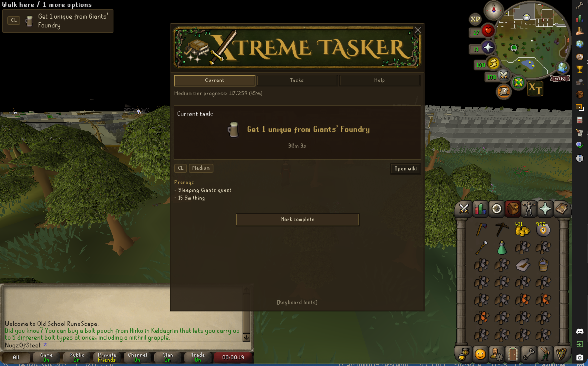

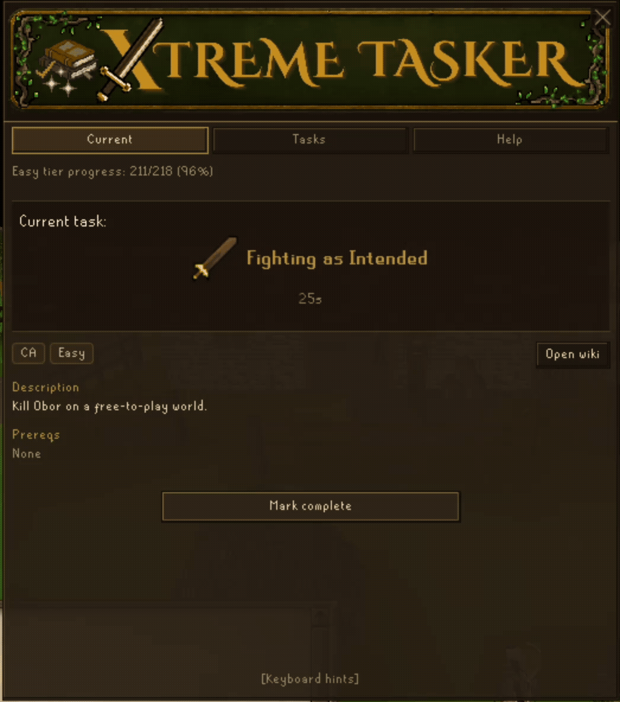

## Overlay Tabs

- `Current`: your active task, tier progress, roll/complete button, prereqs, eligible Collection Log items when useful, and wiki link.
- `Tasks`: the full task list with search, filters, sorting, details, and manual completion controls.
- `Help`: rules, FAQ links, this README, and manual sync actions.

Both `Current` and `Tasks` include a `[Keyboard hints]` button at the bottom of the panel.

## Tasks Tab

Use the Tasks tab to:

- Search for tasks.
- Filter by source, status, and tier.
- Sort by status, tier, completion date, or time spent.
- Open a task's details.
- Mark tasks complete or incomplete.
- Review newly added tasks when `See New Tasks` appears.

Rows use simple status indicators:

- Empty circle: incomplete.
- Amber partial indicator: some repeated task instances are complete.
- Green completed indicator: complete.
- `NEW`: task was added by a task data update.

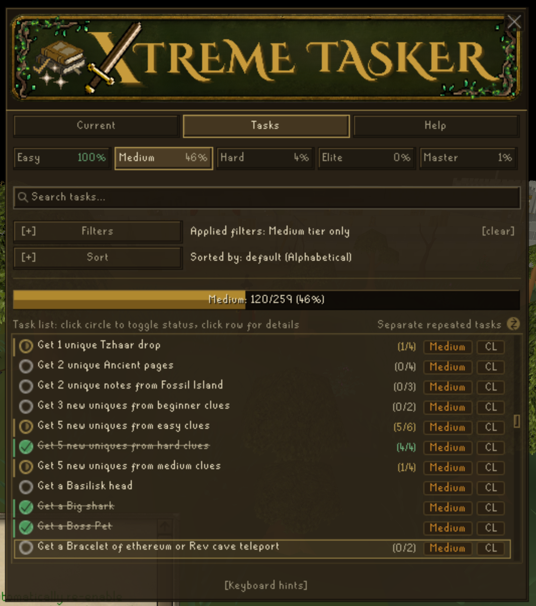

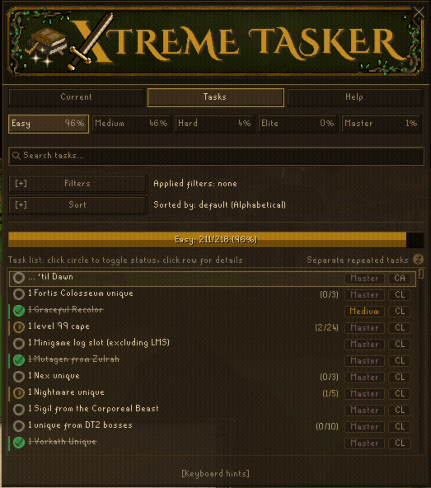

## Repeated Tasks

Some tasks can appear more than once because they can be rolled multiple times.

By default, repeated tasks are condensed into one row with a `#/#` progress indicator. You can expand repeated tasks to inspect each roll individually.

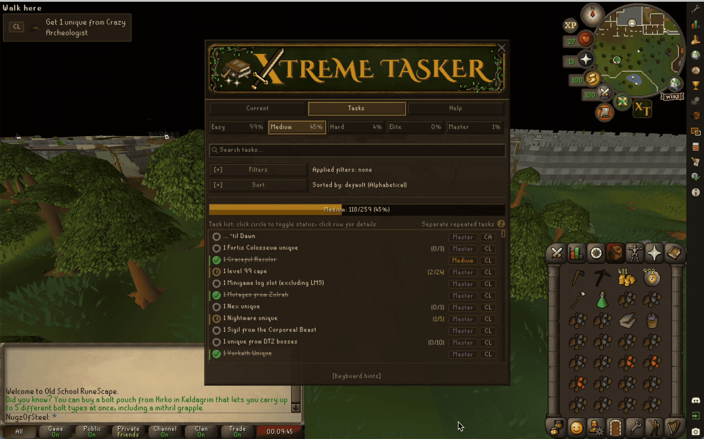

Repeated task details let you mark all instances complete, mark all incomplete after confirmation, or remove completion from a specific completed instance.

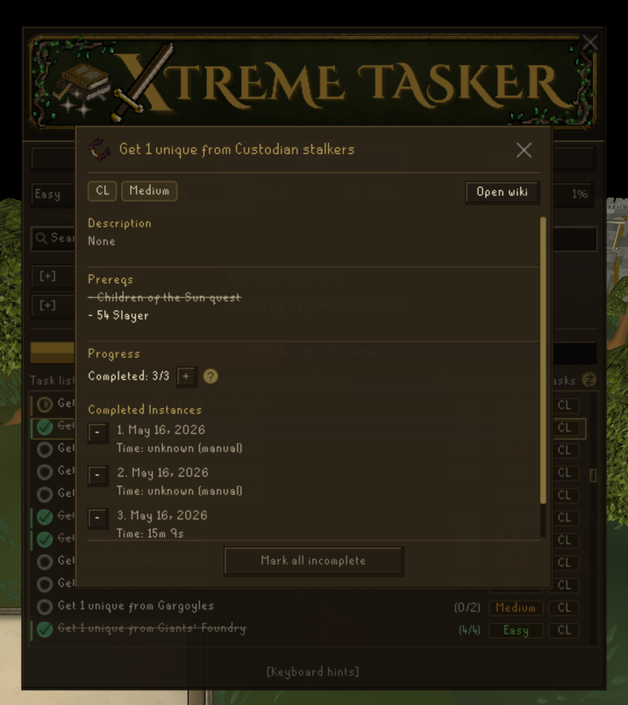

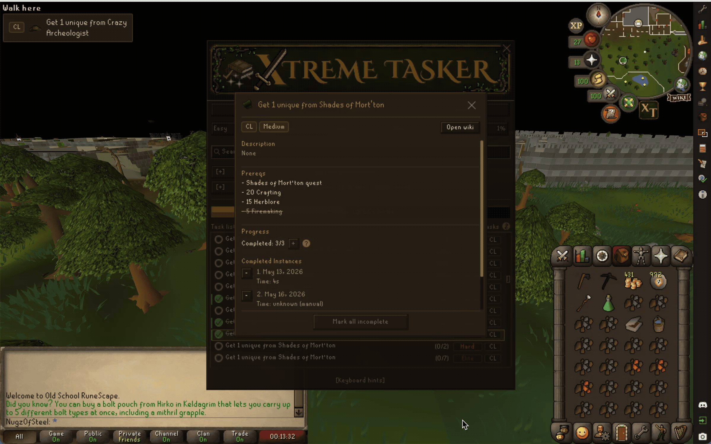

## Collection Log Details

Collection Log task details show eligible items when that list is useful. Items you already have are crossed out.

Single-item Collection Log tasks skip the extra eligible-items section.

For repeated counted Collection Log tasks, Xtreme Tasker may show how many items already counted toward earlier completions, such as `14 obtained; 10 counted toward earlier completions.`

Achievement Diary Collection Log tasks show `Obtained from Achievement Diary rewards.` because they are not normal item drops.

## Task Updates

You no longer need to manually reload or sync the task list.

Xtreme Tasker loads the bundled task list automatically and checks it again when you log in. If new tasks are available, you will see an in-game chat message and a `See New Tasks` button in the Tasks tab.

Use `See New Tasks` to toggle the Tasks tab between the newly added tasks and your normal task list.

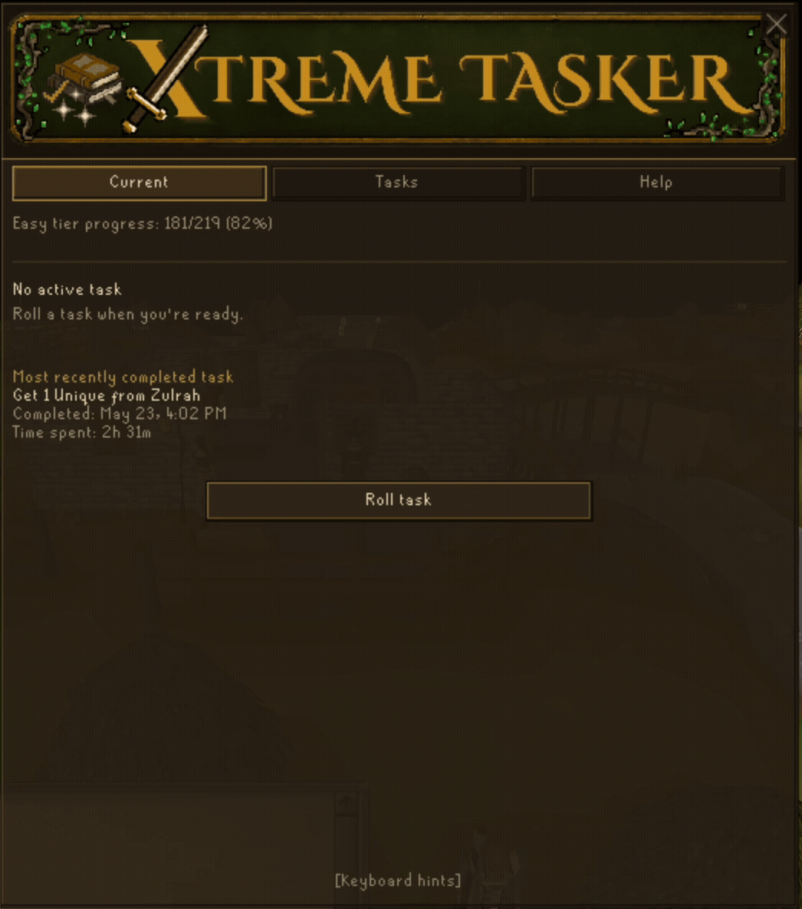

## Manual Progress Sync

Manual sync is only for account progress, not for updating the task list.

Completions marked by you are shown as marked in task details; completions added by `Sync CAs` or `Sync CLOGs` are shown as synced.

`Sync CAs` checks Combat Achievements RuneLite can already see and marks matching Xtreme Tasker tasks complete.

`Sync CLOGs` checks Collection Log items RuneLite has cached. After earning new Collection Log items, open your Collection Log in game so RuneLite can refresh them before syncing.

If sync finds tasks that are marked complete in Xtreme Tasker but not detected in game after sync, the `Help` > `Sync` section shows a review note. Use `Review` to choose which tasks to mark incomplete, or `Ignore` to clear the note until a future sync finds mismatches again. Repeated tasks in review show group completion progress, such as `(1/6)`.

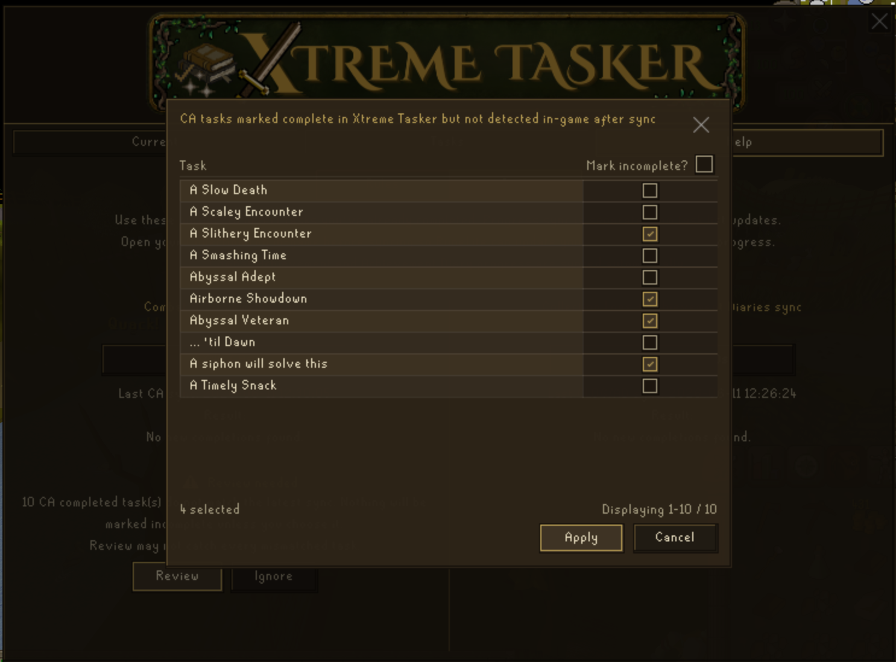

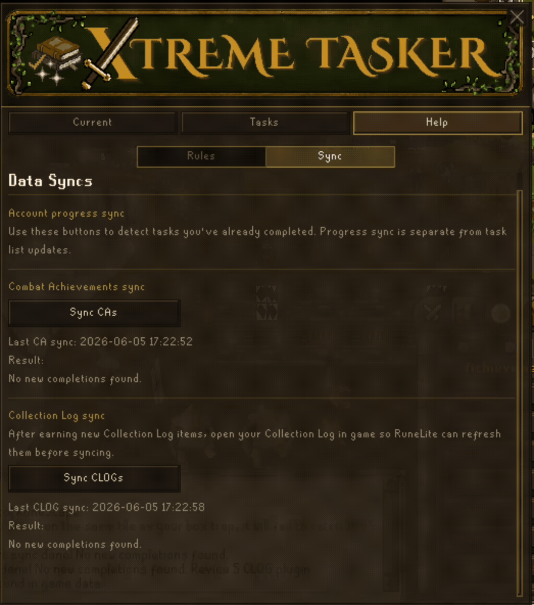

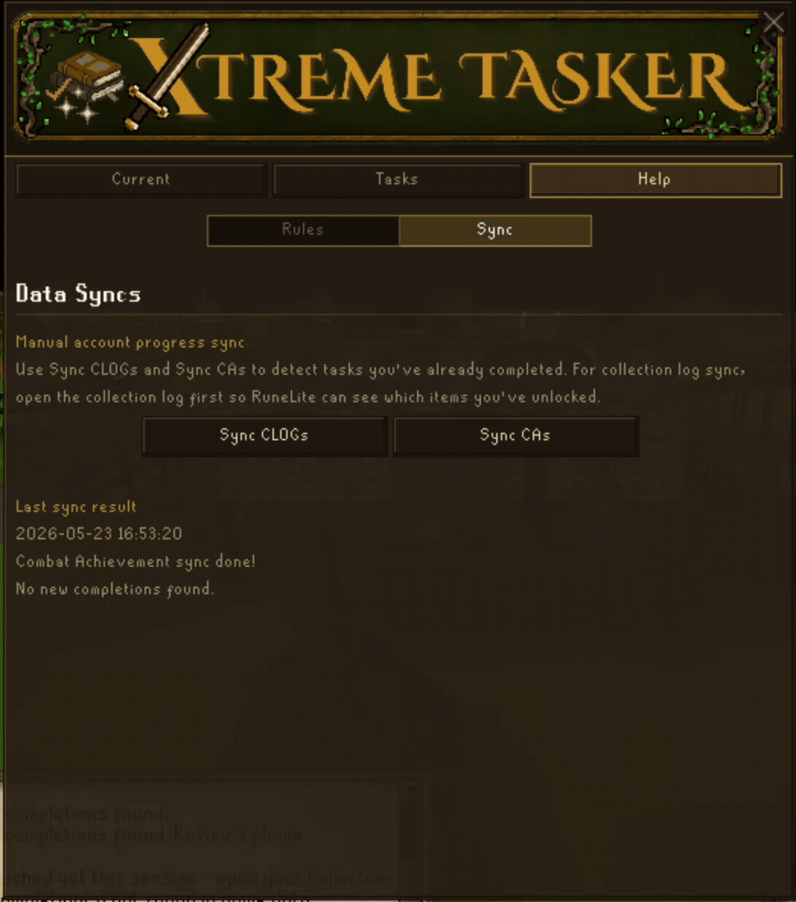

## Saves and Backups

Progress saves locally through RuneLite and is stored per account.

Xtreme Tasker saves important progress changes immediately, keeps three rolling backups, and tries to recover from missing or corrupt saves automatically.

Saves include recovery info such as account hash, last known display name, readable save time, current task, completed task IDs, and retired task IDs.

More details are in the [Detailed Guide](docs/DETAILED_GUIDE.md#progress-saves-and-backups).

## FAQ

### Where are Grandmaster Combat Achievements?

Grandmaster Combat Achievement tasks are included in the Master tier for Xtreme Tasker.

### Can I play with only Combat Achievements or only Collection Log tasks?

You can configure rolls to use only Combat Achievement tasks or only Collection Log tasks. Tier completion still expects both sources, so you cannot fully complete a tier or finish Xtreme Tasker progression without eventually rolling both.

### Why did Sync CLOGs miss an item I already have?

RuneLite can only sync Collection Log items it has seen. Cached items carry across sessions, but after earning new Collection Log items, open your Collection Log in game and run `Sync CLOGs` again.

### Where can I read more?

Use the [Detailed Guide](docs/DETAILED_GUIDE.md) for deeper notes about task sources, repeated tasks, saves, backups, account switching, and manual recovery.

## Rules

Xtreme Tasker follows the official Tasker ruleset and adds Xtreme Tasker-specific guidance for the expanded task list.

The in-game Help tab links to:

- TaskerFAQ for official Tasker rules.
- This README for Xtreme Tasker notes.

### Boss Combat Training Allowance

For any task requiring that you kill a boss with a suggested skills section on the boss strategy page of the OSRS Wiki, you are allowed to train your combat skills to those suggested levels.

Training must be done through Slayer, with any Slayer master or masters of your choosing.

## Privacy

Xtreme Tasker stores progress locally in RuneLite config. It does not send account progress, task progress, or gameplay data to an external service.

Sync features use account state already visible to RuneLite, such as Combat Achievement data and cached Collection Log entries. They do not upload that data anywhere.

The plugin only opens external links when you click wiki, FAQ, or README buttons.
