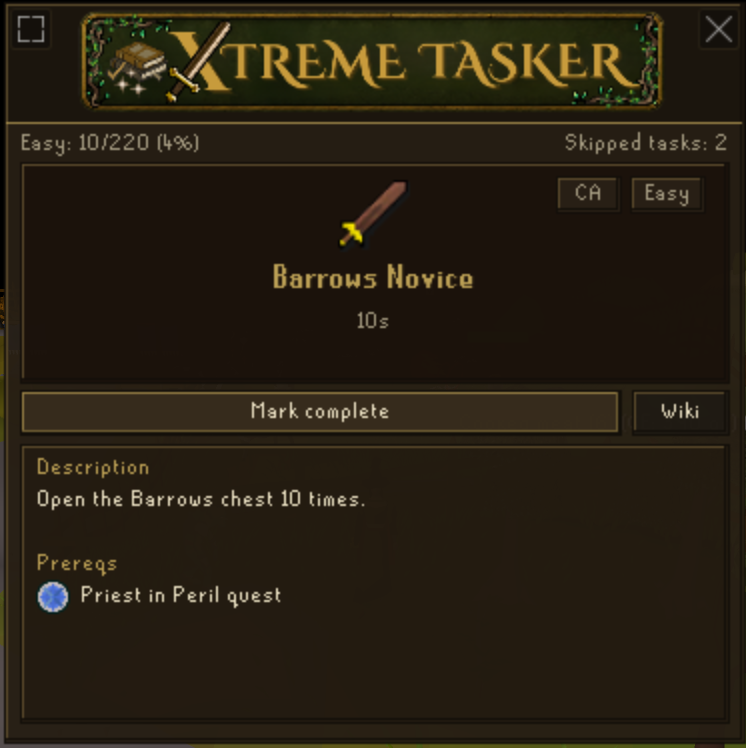

# Xtreme Tasker

Xtreme Tasker is a RuneLite plugin for playing Old School RuneScape with a progressive random task list built from Combat Achievements, Collection Log goals, and Achievement Diaries.

**New RuneLite plugin, released June 2026.**

Xtreme Tasker turns OSRS into a long-term progression challenge by mixing Combat Achievements, Collection Log goals, and Achievement Diaries into one random task journey. The idea was inspired by Tedious' Collection Log Master game mode.

This README covers the basics. For recent changes, see the [Release Notes](docs/RELEASE_NOTES.md). For save details, recovery notes, account switching behavior, and deeper explanations, see the [Detailed Guide](docs/DETAILED_GUIDE.md).

Want to see the plugin in action? Check out [@amtrollin](https://www.youtube.com/@AmTrollin/playlists)'s YouTube series, [Xtreme Tasker](https://www.youtube.com/playlist?list=PLyKVvPO_c8ffVO0H73Kxnnwz5J6DZir4H).

## What It Does

- Roll a random incomplete task from your current progression tier.
- Track Easy through Master tier progress in an overlay.
- Browse, search, filter, and sort the full task list.

## Quick Start

1. Open the Xtreme Tasker overlay.
2. If you already have account progress, open `Help` > `Sync` and sync CAs or CLOGs+ADs before rolling.
3. Use the `Current` tab to roll your first task.
4. Complete the task in game.
5. Sync/review progress, then roll the next task.

Your current task and completion progress are saved locally per character.

## Overlay Tabs

- `Current`: your active task, tier progress, prereqs, source-specific task details, and wiki link.
- `Tasks`: the full task list with search, filters, sorting, and task details.
- `Help`: rules, FAQ links, this README, and progress sync actions.

Both `Current` and `Tasks` include a `Keyboard hints` control at the bottom of the panel.

## Compact View

Use the view toggle in the overlay corner to switch between full view and compact view. Compact view keeps the current task, timer, wiki link, and scrollable details visible in a smaller panel for tighter screens or less intrusive play.

## Tasks Tab

Use the Tasks tab to search the full task list, filter by source/status/tier, sort rows, and open task details. If a plugin update adds tasks, `See New Tasks` lets you review just the new rows.

## Repeated Tasks

Some tasks can appear more than once because they can be rolled multiple times.

By default, repeated tasks are condensed into one row with a `#/#` progress indicator. You can expand repeated tasks to inspect each roll individually.

## Collection Log Details

When a Collection Log task has several possible items, task details show the eligible items. Items you already have are checked off.

Tasks with counted Collection Log requirements show progress against the required count.

Opening your Collection Log in game lets Xtreme Tasker cache seen and obtained item slots for sync. If Sync CLOGs+ADs seems to miss a Collection Log item, open the relevant Collection Log page in game and sync again.

## Achievement Diary Details

Achievement Diary tasks show their diary region, task master, and prereqs. They sync from in game diary completion state rather than Collection Log item drops.

## Task Updates

Task list updates are separate from account progress sync.

Xtreme Tasker loads the bundled task list automatically when the plugin starts. If a plugin update adds tasks, you will see an in game chat message and a `See New Tasks` button in the Tasks tab.

Use `See New Tasks` to toggle the Tasks tab between the newly added tasks and your normal task list.

## Progress Sync

Progress sync is for your account state, not task list updates.

`Sync CAs` checks Combat Achievements. `Sync CLOGs+ADs` checks cached Collection Log items, Achievement Diaries, and supported skill-count requirements. Sync results are staged for review before tasks are updated.

Collection Log sync can only use items Xtreme Tasker has seen through RuneLite. After earning new Collection Log items, open your Collection Log in game and sync again.

## Rules

Xtreme Tasker follows the official Tasker ruleset and adds Xtreme Tasker-specific guidance for the expanded task list.

The in game Help tab links to:

- TaskerFAQ for official Tasker rules.
- This README for Xtreme Tasker notes.

### Boss Combat Training Allowance

For any task requiring that you kill a boss with a suggested skills section on the boss strategy page of the OSRS Wiki, you are allowed to train your combat skills to those suggested levels.

Training must be done through Slayer, with any Slayer master or masters of your choosing.

## FAQ

### Where are Grandmaster Combat Achievements?

Grandmaster Combat Achievement tasks are included in the Master tier for Xtreme Tasker.

### Can I play with only Combat Achievements or only Collection Log and Achievement Diary tasks?

You can configure rolls to use only Combat Achievement tasks or only Collection Log and Achievement Diary tasks. Tier completion still expects all sources, so you cannot fully complete a tier or finish Xtreme Tasker progression without eventually rolling the others.

### Can I skip a task?

Task skipping is off by default. If you enable `Enable task skipping` in plugin config, the Current tab shows a Skip button that rerolls the current task and increments your skipped task count.

### Why did Sync CLOGs+ADs miss an item I already have?

Xtreme Tasker can only sync Collection Log items it has seen through RuneLite. Cached items carry across sessions, but after earning new Collection Log items, open your Collection Log in game and run `Sync CLOGs+ADs` again. Achievement Diaries sync from diary completion state.

### Where is my progress saved?

Progress is saved per character under `~/.runelite/xtreme-tasker-states/` and mirrored into RuneLite config for compatibility. The plugin keeps rolling local backups and can restore or repair from the newest valid backup if the primary save cannot be read.

### Where can I read more?

Use the [Detailed Guide](docs/DETAILED_GUIDE.md) for deeper notes about task sources, repeated tasks, saves, backups, account switching, and manual recovery.

## Privacy

Xtreme Tasker stores progress locally in JSON state files under your RuneLite folder and mirrors progress into RuneLite config for compatibility. It does not send account progress, task progress, or gameplay data to an external service.

Sync features use account state already visible to RuneLite, such as Combat Achievement data, cached Collection Log entries, and Achievement Diary state. They do not upload that data anywhere.

The plugin itself only opens external links when you click wiki, FAQ, or README buttons. This documentation also links to the @amtrollin YouTube channel and Xtreme Tasker playlist.
