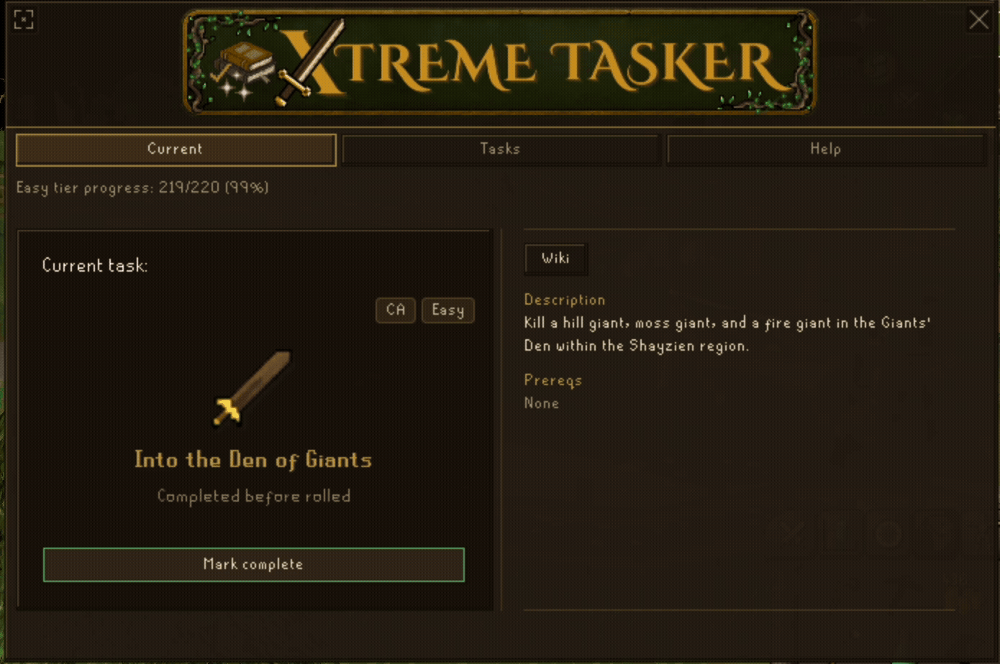
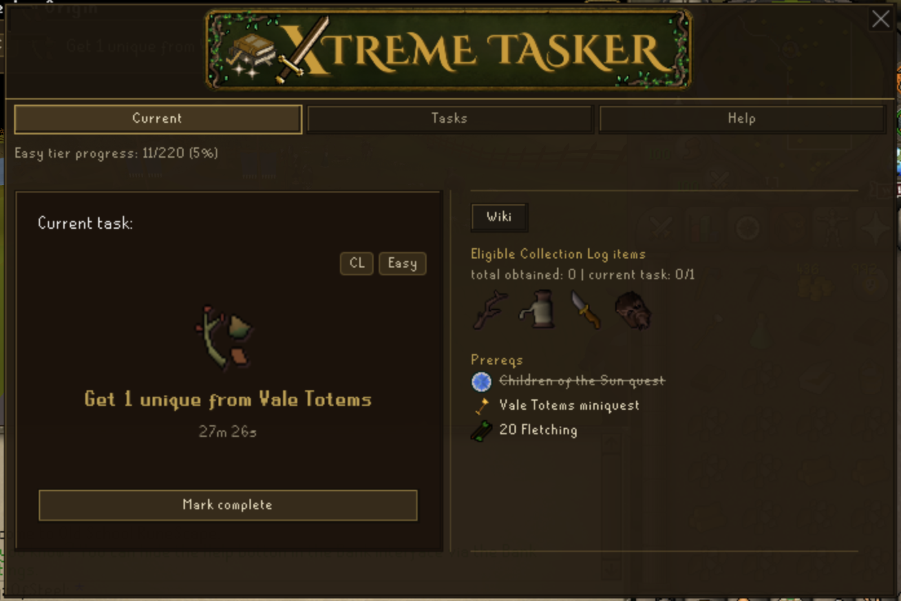
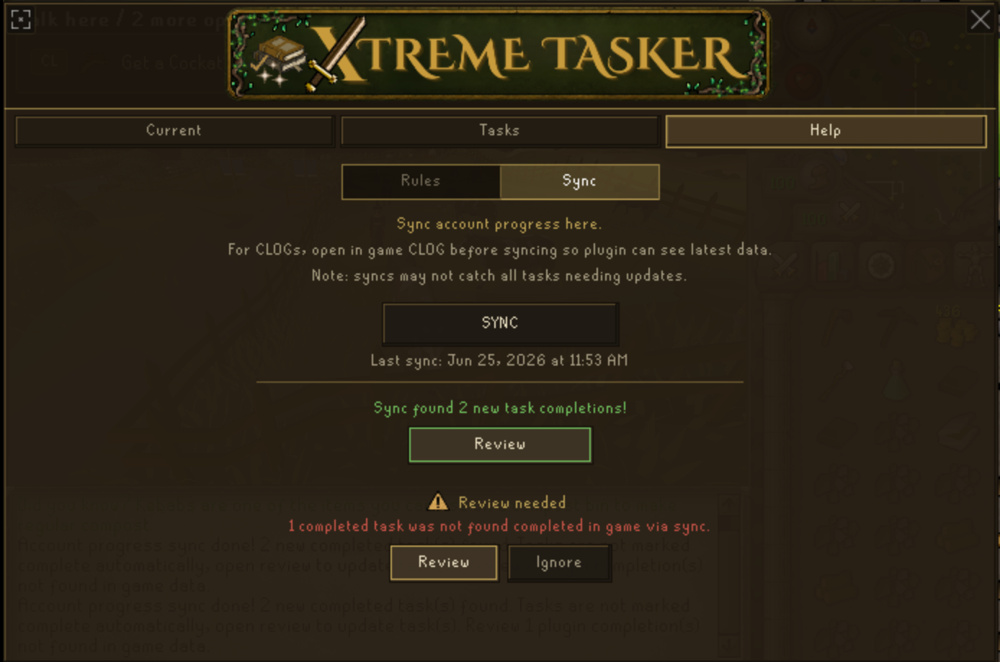

# Xtreme Tasker

Xtreme Tasker is a RuneLite plugin that turns Old School RuneScape into a long-term progression challenge using randomized Combat Achievements, Collection Log goals, and Achievement Diaries.

**Latest release:** **v2.0** - **06.25.2026** ([Release Notes](docs/RELEASE_NOTES.md))

Inspired by Tedious' Collection Log Master game mode, Xtreme Tasker combines multiple progression systems into one randomized journey.

Want to see it in action? Check out [@amtrollin](https://www.youtube.com/@AmTrollin/playlists)'s **[Xtreme Tasker](https://www.youtube.com/playlist?list=PLyKVvPO_c8ffVO0H73Kxnnwz5J6DZir4H)** series.

## Overview

* Roll randomized Combat Achievement, Collection Log, and Achievement Diary tasks
* Progress through Easy, Medium, Hard, Elite, and Master tiers
* Track your current task, timer, requirements, and tier progress
* Search and filter the complete task list
* Sync existing account progress with review before applying changes
* Store progress locally per RuneLite character profile

## Getting Started

Open the Xtreme Tasker overlay. If importing an existing account, go to **Help → Sync**, then roll your first task from the **Current** tab.

> **Collection Log syncing only includes entries RuneLite has seen.** For best results, open your in game Collection Log before syncing.

## Features

### Current Task

Track your active task, view requirements, open relevant wiki pages, and roll your next challenge after completion.

### Task List

Browse every task with search, filtering, progress tracking, and detailed task information.

### Account Sync

Import supported Combat Achievement, Collection Log, Achievement Diary, and skill progress. Changes are staged for review before being applied.

When plugin updates add new tasks, they'll appear in the **Tasks** tab for review separately from account sync.

## Rules

Xtreme Tasker follows the official Tasker ruleset with additional rules for the expanded task list.

Grandmaster Combat Achievements are included in the **Master** tier.

## Privacy

Xtreme Tasker stores progress locally in your RuneLite profile and mirrors it to RuneLite config for compatibility. No account progress or gameplay data is sent to external services.

Sync only reads data already available to RuneLite, such as Combat Achievements, cached Collection Log entries, and Achievement Diaries. External links are only opened when you click them.
